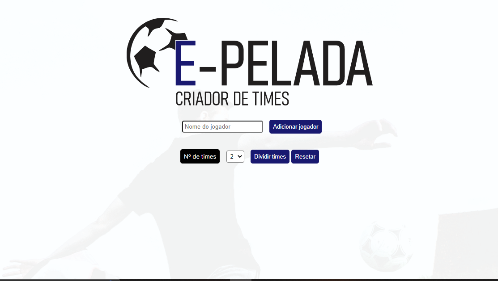

<h1 align="center"> E-pelada </h1>

O criador de times "E-pelada" foi desenvolvido para auxiliar na divisão de times, nos mais variados esportes coletivos, com foco nas tão disputadas "peladas" do nosso Brasil.  

  <a href="#-tecnologias">Tecnologias</a>&nbsp;&nbsp;&nbsp;|&nbsp;&nbsp;&nbsp;
  <a href="#-projeto">Projeto</a>&nbsp;&nbsp;&nbsp;|&nbsp;&nbsp;&nbsp;
  <a href="#-layout">Layout</a>&nbsp;&nbsp;&nbsp;|&nbsp;&nbsp;&nbsp;
  <a href="#memo-licença">Licença</a>

  

  

## ⚙️ Tecnologias

Esse projeto foi desenvolvido com as seguintes tecnologias:

- HTML e CSS
- JavaScript
- Git e Github

## 💻 Projeto

O E-pelada foi desenvolvido como prática de estudo em desenvolvimento front-end.

- [Visite o projeto online](https://github.com/Cassiocominetti/E-pelada)

- [Acesse o app](https://cassiocominetti.github.io/E-pelada/)

## Licença

Esse projeto está sob a licença MIT.

---

Desenvolvido por Cassiano Cominetti.
 

## Contatos

